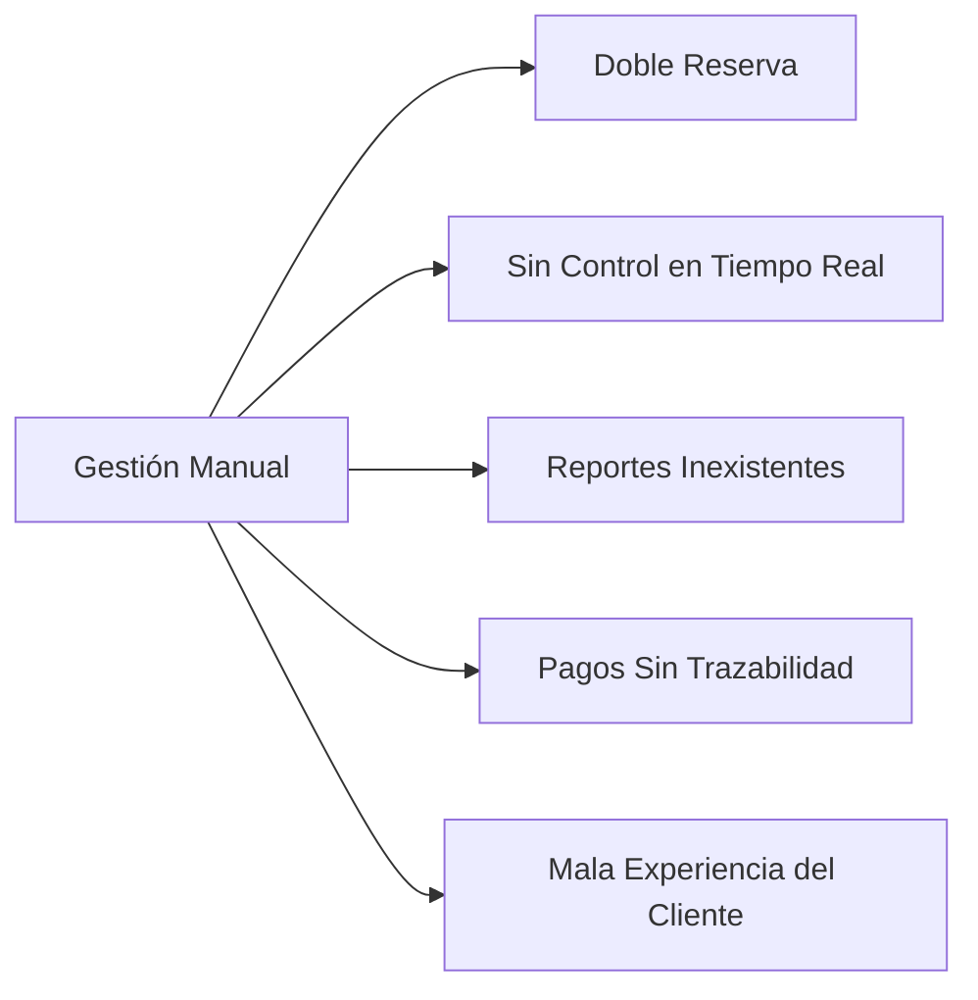
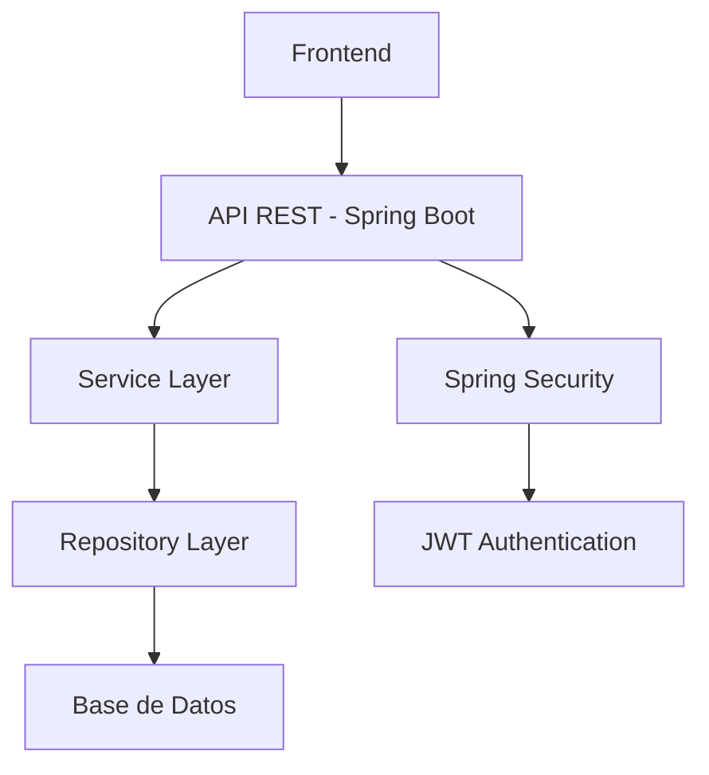

# Sistema de Gestión de Reservas para Coworking

> **API REST desarrollada en Spring Boot para la gestión eficiente de espacios de coworking**

[](#)
[](#)
[](#)
[](#)

---

## 📋 Tabla de Contenido

- [Sistema de Gestión de Reservas para Coworking](#sistema-de-gestión-de-reservas-para-coworking)
  - [📋 Tabla de Contenido](#-tabla-de-contenido)
  - [🎯 Justificación del Proyecto](#-justificación-del-proyecto)
    - [Problemas Identificados](#problemas-identificados)
    - [Pertinencia Tecnológica](#pertinencia-tecnológica)
  - [🔍 Análisis del Problema](#-análisis-del-problema)
    - [Espacios Disponibles](#espacios-disponibles)
    - [Modalidades de Reserva](#modalidades-de-reserva)
    - [Problemática Actual](#problemática-actual)
  - [⚡ Solución Propuesta](#-solución-propuesta)
    - [API REST en Spring Boot](#api-rest-en-spring-boot)
    - [Arquitectura del Sistema](#arquitectura-del-sistema)
  - [👥 Actores del Sistema](#-actores-del-sistema)
    - [🔧 Administrador](#-administrador)
    - [👤 Cliente/Usuario](#-clienteusuario)
  - [📋 Requerimientos](#-requerimientos)
    - [Requerimientos Funcionales](#requerimientos-funcionales)
    - [Requerimientos No Funcionales](#requerimientos-no-funcionales)
  - [📖 Historias de Usuario](#-historias-de-usuario)
  - [🏗️ Arquitectura y Diseño de Base de Datos](#️-arquitectura-y-diseño-de-base-de-datos)
    - [Componentes de la Arquitectura](#componentes-de-la-arquitectura)
  - [📊 Sprint Planning](#-sprint-planning)
  - [🚀 Instalación y Configuración](#-instalación-y-configuración)
    - [Prerrequisitos](#prerrequisitos)
    - [Configuración del Entorno](#configuración-del-entorno)
    - [Variables de Entorno](#variables-de-entorno)
  - [🤝 Contribución](#-contribución)
    - [Flujo de Contribución](#flujo-de-contribución)
    - [Estándares de Código](#estándares-de-código)
  - [📄 Licencia](#-licencia)

---

## 🎯 Justificación del Proyecto

El crecimiento exponencial del **trabajo remoto**, el **emprendimiento digital** y los **equipos híbridos** ha incrementado significativamente la demanda de espacios de coworking. Estos espacios requieren una gestión eficiente de:

- Oficinas compartidas
- Salas de reuniones
- Escritorios individuales
- Áreas colaborativas

### Problemas Identificados

La mayoría de coworkings pequeños y medianos gestionan sus reservas mediante:

- Hojas de cálculo
- Mensajes por WhatsApp
- Agendas manuales

Esto genera las siguientes problemáticas:



### Pertinencia Tecnológica

**Spring Boot** es la tecnología ideal para este proyecto porque:

| Característica         | Beneficio                               |
| ---------------------- | --------------------------------------- |
| APIs REST              | Desarrollo ágil y escalable             |
| JPA/Hibernate          | Integración robusta con bases de datos  |
| Spring Security        | Autenticación y autorización enterprise |
| Ecosistema Empresarial | Amplia adopción y soporte               |
| Escalabilidad          | Potencial producto comercial            |

---

## 🔍 Análisis del Problema

### Espacios Disponibles

Un espacio de coworking típico ofrece:

<details>
<summary><strong>Tipos de Espacios</strong></summary>

- **Escritorios Individuales**: Puestos de trabajo personal
- **Oficinas Privadas**: Espacios cerrados para equipos
- **Salas de Reuniones**: Equipadas con tecnología
- **Salas de Eventos**: Para presentaciones y conferencias

</details>

### Modalidades de Reserva

- **Por Horas**: Uso temporal
- **Por Días**: Trabajo intensivo
- **Membresías Mensuales**: Uso recurrente

### Problemática Actual

> **Desafíos Críticos**

- ❌ Sin control automático de disponibilidad
- ❌ Sin validación de conflictos de horario
- ❌ Errores humanos en proceso manual
- ❌ Ausencia de métricas de ocupación
- ❌ Falta de trazabilidad digital

---

## ⚡ Solución Propuesta

### API REST en Spring Boot

Desarrollar una solución integral que:

```yaml
Funcionalidades_Core:
  - Registro y autenticación de usuarios
  - Consulta de espacios disponibles
  - Sistema de reservas con validación de conflictos
  - Generación de reportes administrativos
  - Control de acceso basado en roles
```

### Arquitectura del Sistema



---

## 👥 Actores del Sistema

### 🔧 Administrador

- **Gestión de Espacios**: CRUD completo
- **Gestión de Usuarios**: Control total
- **Reportes y Analytics**: Métricas de ocupación
- **Control de Reservas**: Confirmación y cancelación

### 👤 Cliente/Usuario

- **Registro Personal**: Autoregistro en plataforma
- **Consulta de Disponibilidad**: Búsqueda en tiempo real
- **Gestión de Reservas**: Crear, consultar y cancelar
- **Historial Personal**: Trazabilidad de reservas

---

## 📋 Requerimientos

### Requerimientos Funcionales

| ID       | Requerimiento                                     | Actor                          |
| -------- | ------------------------------------------------- | ------------------------------ |
| **RF01** | Registro de usuarios en el sistema                | Cliente/Usuario                |
| **RF02** | Autenticación con usuario y contraseña            | Cliente/Usuario, Administrador |
| **RF03** | Consulta de espacios disponibles                  | Cliente/Usuario                |
| **RF04** | Consulta de disponibilidad por fecha y horario    | Cliente/Usuario                |
| **RF05** | Creación de reservas con validación de conflictos | Cliente/Usuario                |
| **RF06** | Cancelación de reservas                           | Cliente/Usuario                |
| **RF07** | CRUD de espacios (solo administrador)             | Administrador                  |
| **RF08** | Visualización de todas las reservas               | Administrador                  |
| **RF09** | Historial de reservas por usuario                 | Cliente/Usuario                |
| **RF10** | Generación de reportes de ocupación               | Administrador                  |

### Requerimientos No Funcionales

| ID        | Requerimiento                               | Categoría         |
| --------- | ------------------------------------------- | ----------------- |
| **RNF01** | Desarrollo en Spring Boot                   | Tecnológico       |
| **RNF02** | Arquitectura REST                           | Arquitectura      |
| **RNF03** | Base de datos relacional (MySQL/PostgreSQL) | Tecnológico       |
| **RNF04** | Autenticación con Spring Security           | Seguridad         |
| **RNF05** | Validaciones de integridad de datos         | Calidad/Seguridad |
| **RNF06** | Tiempo de respuesta < 2 segundos            | Rendimiento       |
| **RNF07** | Escalabilidad futura                        | Escalabilidad     |
| **RNF08** | Arquitectura en capas                       | Mantenibilidad    |
| **RNF09** | Control de roles (ADMIN/USER)               | Seguridad         |
| **RNF10** | Manejo global de excepciones                | Mantenibilidad    |

---

## 📖 Historias de Usuario

<details>
<summary><strong>HU01 - Registro de Usuario</strong></summary>

**Como** usuario nuevo  
**Quiero** registrarme en el sistema  
**Para** acceder a los servicios de coworking

**Criterios de Aceptación:**

- Debe solicitar nombre, correo y contraseña
- El correo no puede repetirse en el sistema
- La contraseña debe tener mínimo 8 caracteres

</details>

<details>
<summary><strong>HU02 - Iniciar Sesión</strong></summary>

**Como** usuario registrado  
**Quiero** autenticarme en el sistema  
**Para** acceder a mis funcionalidades

**Criterios de Aceptación:**

- Debe validar credenciales correctamente
- Debe generar token JWT
- Debe restringir acceso con credenciales inválidas

</details>

<details>
<summary><strong>HU03 - Consultar Disponibilidad</strong></summary>

**Como** usuario  
**Quiero** consultar disponibilidad de espacios  
**Para** planificar mis reservas

**Criterios de Aceptación:**

- Debe permitir filtrar por fecha
- Debe mostrar horarios ocupados
- No debe mostrar espacios inactivos

</details>

<details>
<summary><strong>HU04 - Crear Reserva</strong></summary>

**Como** usuario autenticado  
**Quiero** crear una reserva  
**Para** asegurar mi espacio de trabajo

**Criterios de Aceptación:**

- No debe permitir solapamiento de reservas
- Debe validar autenticación del usuario
- Debe guardar fecha, hora inicio y hora fin

</details>

<details>
<summary><strong>HU05 - Cancelar Reserva</strong></summary>

**Como** usuario propietario de una reserva  
**Quiero** cancelar mi reserva  
**Para** liberar el espacio

**Criterios de Aceptación:**

- Solo el propietario o administrador puede cancelar
- Debe cambiar estado a CANCELADA

</details>

<details>
<summary><strong>HU06 - Gestión de Espacios (Admin)</strong></summary>

**Como** administrador  
**Quiero** gestionar los espacios del coworking  
**Para** mantener actualizada la oferta

**Criterios de Aceptación:**

- Solo rol ADMIN puede acceder
- Debe permitir definir tipo, capacidad y precio

</details>

---

## 🏗️ Arquitectura y Diseño de Base de Datos

[](https://mermaid.live/edit#pako:eNqlVG1vokAQ_iub_WwNKlwp3zjl7khrNUCby4WEbJdRNye7ZIB7qfW_d1GqVGnu0u4n5u2ZmWdm2FCuUqAOBZwItkSWxTKWRL9gduOFZLMX6vfZ_-rfRkSkZH591N67wfibGxCpsgeEvX77gnEX3rmBP3snTFvPFSKoc33OiuK3wrSFP9OFu7eE8VL8akVE_tQLI3c6JwvgK5YgLEVRojqrDNU60dV9uT5pJvLnszDxwrk79mfv7yjyvkckhYKjyLlQ8iRLg_8BympXznLGRcpavEy8sT91b0iOoNMmucJkpZD9m7gmeyly1clLzepEMxN4oRfcux9cmQblP_qfuJG3n-XrIZO6rURIodvssiyEfHsrOAI7TqWVvCoqhuIVAy0rFDXfb1tLlnaTt7-yp6eLC7U5nouj2QYJXXvXuB7WxCF8zQqxEJyd3FzjeSDUIbq3tXhkJ4vW5cfFA3RP99w7Bc0o0B5dokipU2IFPZoBZqwW6W6OMS1XkEFMHf2ZMvwZ01hudUzO5A-lspcwVNVyRZ0FWxdaqvKUldD8lw5aBJkCjlUlS-oMrR0GdTb0j5YG_U-GZY1sa3Bl2pY17NG_1BnZfdMwTHto27Y5MC5H1rZHH3dZjf6VadqGORgNrmzzUhu3z4sZbMs)

_Diagrama completo de la arquitectura del sistema y diseño de la base de datos, mostrando la interacción entre componentes y la estructura de datos_

### Componentes de la Arquitectura

- **Frontend**: Interfaz de usuario para interactuar con el sistema
- **API REST**: Controladores que exponen los endpoints del servicio
- **Service Layer**: Lógica de negocio y validaciones
- **Repository Layer**: Acceso a datos mediante JPA/Hibernate
- **Base de Datos**: Almacenamiento persistente de la información
- **Spring Security**: Manejo de autenticación y autorización
- **JWT Authentication**: Sistema de tokens para sesiones seguras

## 📊 Sprint Planning

> **Gestión del proyecto con metodología Scrum**

_Esta sección incluirá:_

- Imagen del sprint actual en Jira
- Burndown chart
- User stories en progreso
- Tareas completadas

---

## 🚀 Instalación y Configuración

### Prerrequisitos

```bash
Java 17+
Maven 3.6+
MySQL 8.0+ / PostgreSQL 12+
Git
```

### Configuración del Entorno

```bash
# Clonar repositorio
git clone https://github.com/tu-usuario/coworking-management.git

# Navegar al directorio
cd coworking-management

# Configurar base de datos en application.properties

# Ejecutar aplicación
mvn spring-boot:run
```

### Variables de Entorno

```properties
DB_HOST=localhost
DB_PORT=3306
DB_NAME=coworking_db
DB_USER=tu_usuario
DB_PASSWORD=tu_password
JWT_SECRET=tu_jwt_secret
```

---

## 🤝 Contribución

### Flujo de Contribución

1. **Fork** el proyecto
2. **Clone** tu fork: `git clone <tu-fork>`
3. **Crea** una rama: `git checkout -b feature/nueva-funcionalidad`
4. **Commit** tus cambios: `git commit -m 'feat: nueva funcionalidad'`
5. **Push** a la rama: `git push origin feature/nueva-funcionalidad`
6. **Abre** un Pull Request

### Estándares de Código

- Seguir convenciones de **Spring Boot**
- Documentar métodos públicos con **JavaDoc**
- Escribir tests unitarios
- Utilizar **Conventional Commits**

---

## 📄 Licencia

Este proyecto está bajo la Licencia MIT - ver el archivo [LICENSE.md](LICENSE.md) para detalles.

---

<div align="center">
  <p><strong>Desarrollado con ❤️ para la comunidad de coworking</strong></p>
  <p><em>© 2026 Sistema de Gestión de Reservas para Coworking</em></p>
</div>
